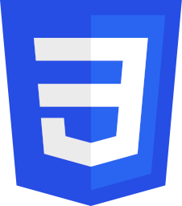

## 👉 About me
- Languages: English, (learning) Mandarin
- Computing languages: Java, Python, Go, HTML, CSS, JavaScript, (learning) C/C++
- I'm a senior in High School

## 👉 Languages

## 👉 GitHub Presence

